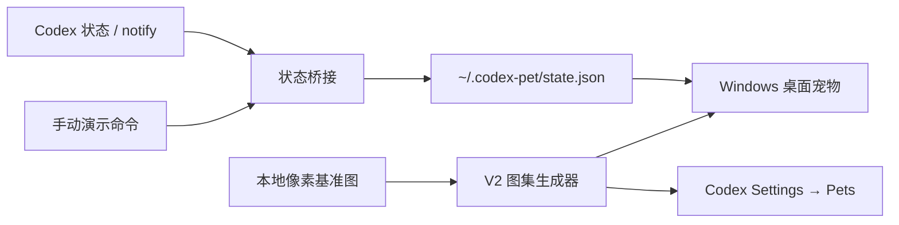

# Codex Pet

一只住在 Windows 桌面和 Codex 里的像素企鹅。

Codex Pet 把 Codex 的工作、等待、完成和失败状态变成桌面宠物动作。当前原型包含两种形态：

- **Codex 内置宠物**：使用 Codex Pets V2 图集，可在 Codex 设置中选择。
- **Windows 桌面宠物**：透明、置顶、可拖动，带右键菜单、托盘、位置记忆和开机启动。

> 当前版本：`0.1.0`。代码仓库不分发 QQ、腾讯或其他第三方拥有权利的角色素材；经典企鹅像素重绘只用于本地原型，并被 Git 忽略。

## 当前进度

- [x] D 盘本地仓库与 GitHub 远程仓库连接
- [x] 经典红围巾企鹅的本地像素基准图
- [x] Codex Pets V2 `8 × 11` 动作图集
- [x] 通过当前 Codex 官方图集校验器（零错误、零警告）
- [x] 安装到本机 Codex Pets 目录
- [x] Windows 透明置顶桌面宠物
- [x] 自动左右巡游、碰边转向、随机闲逛动作
- [x] 正面、侧面、背面、躺下与打滚像素关键帧
- [x] 拖动、位置记忆、动作菜单、托盘与开机启动
- [x] Codex 状态文件桥接与动作演示
- [x] 可直接运行的 Windows 便携包
- [ ] 自动观察现有 Codex 桌面任务的全部实时阶段
- [ ] 经过代码签名的 `.exe` / NSIS 安装包

## 立即运行

环境要求：Windows 10/11、Node.js 20.19+ 或 22.12+、pnpm 11+；推荐 Node.js 24。本仓库已在 Node.js 24 与 pnpm 11 上验证。

```powershell
pnpm install
pnpm assets:prepare
pnpm dev
```

干净克隆没有本地角色素材时，会自动生成并使用公开的几何占位企鹅，因此以上命令仍可直接运行。放入本地经典企鹅基准图后，再次执行 `pnpm assets:prepare` 即会切换为本地经典形象。

也可以直接双击：

```text
windows\Start-CodexPet.cmd
```

操作方式：

- 按住企鹅左键拖动。
- 双击企鹅触发挥手。
- 放着不管时会自动左右散步、回头偷看、张望、跳跃、躺下或打滚，碰到屏幕边缘会转向。
- 右键打开菜单，可开关自动闲逛，并立即指定侧身跑、背身偷看、躺下、打滚等动作。
- 右键菜单也可暂停动画、设置开机启动、隐藏或退出。
- 隐藏后可从系统托盘重新显示。

## 本地角色素材

公开仓库只包含程序、图集生成器和无权利负担的占位图，不包含经典 QQ 企鹅素材。

开发者需自行准备有权使用的透明 PNG，并放到：

```text
.local-assets\qq-penguin\pixel-base.png
```

可选的 `4 × 4` 多姿态像素表可放到：

```text
.local-assets\qq-penguin\poses\pose-sheet-v1.png
```

四行依次用于左侧身跑、右侧身跑、背面/回头姿态和躺下/打滚姿态。缺少该文件时仍会从正面基准图生成兼容动作。

随后运行：

```powershell
pnpm assets:build
```

生成器会自动完成绿幕残留清理、主体裁剪、限色像素化、动作帧生成和 V2 图集组装。所有衍生素材继续留在 `.local-assets/`，不会被 Git 提交。

## 安装到 Codex

```powershell
pnpm assets:install
```

存在本地经典企鹅素材时安装到：

```text
%CODEX_HOME%\pets\qq-penguin\
```

未设置 `CODEX_HOME` 时使用：

```text
%USERPROFILE%\.codex\pets\qq-penguin\
```

安装后进入 Codex 的 `Settings → Pets`，点击刷新并选择 `QQ Penguin`。运行时 ID 为 `custom:qq-penguin`。

没有本地经典素材时会安装公开占位宠物到 `pets\codex-penguin-placeholder`，运行时 ID 为 `custom:codex-penguin-placeholder`。

## Codex Pets V2 接口

当前图集规格：

- 图集：透明 PNG 或 WebP，`1536 × 2288`
- 网格：8 列 × 11 行
- 单帧：`192 × 208`
- `pet.json` 必须显式设置 `"spriteVersionNumber": 2`

| 行 | 动作 | 有效帧 |
| --- | --- | ---: |
| 0 | idle | 6 帧，另在第 7 格保留校验用中性帧 |
| 1 | running-right | 8 |
| 2 | running-left | 8 |
| 3 | waving | 4 |
| 4 | jumping | 5 |
| 5 | failed | 8 |
| 6 | waiting | 6 |
| 7 | running / working | 6 |
| 8 | review | 6 |
| 9–10 | 16 个顺时针视线方向 | 每行 8 |

完整契约见 [docs/codex-pet-contract.md](docs/codex-pet-contract.md)。

## 状态桥接

Windows 宠物读取：

```text
%USERPROFILE%\.codex-pet\state.json
```

可以用命令模拟状态：

```powershell
pnpm state running
pnpm state waiting
pnpm state jumping
pnpm state failed
pnpm state idle
```

状态文件格式：

```json
{
  "state": "running",
  "updatedAt": 1783950000000,
  "source": "codex-notify"
}
```

标准 Codex 状态为：`idle`、`running-right`、`running-left`、`waving`、`jumping`、`failed`、`waiting`、`running`、`review`。独立桌面版另外支持：`looking`、`mischief`、`lying`、`rolling`。

Codex 的 `notify` 可在每轮完成时调用 `scripts/codex-notify.mjs`，把结果映射为庆祝或失败动作。它不是完整的实时会话监听器；正在工作、等待输入等阶段仍通过状态桥接器或未来的 App Server 适配器提供。

## 构建便携版

```powershell
pnpm build
```

输出：

```text
release\CodexPet-portable\
release\Codex-Pet-0.1.0-portable.zip
```

便携版不编译或安装未签名程序，适合启用了严格 Windows 应用控制策略的电脑。

## 项目结构

```text
src/                 Tauri/Web 前端状态机
src-tauri/           Tauri 2 原生桌面壳（后续签名安装包）
windows/             当前可运行的 PowerShell/WPF 桌面壳
scripts/             图集生成、安装和状态桥接
docs/                角色、接口与架构说明
public/placeholder.svg 公开占位角色
.local-assets/       本地第三方素材与衍生文件（Git 忽略）
```



## 验证

```powershell
pnpm check
pnpm smoke
pnpm assets:validate
pnpm build
```

`pnpm smoke` 会启动真实 WPF 窗口、渲染图集并保存本地截图后自动退出；`pnpm assets:validate` 使用当前 Codex 安装内置的官方校验器进行 V2 验证。

官方校验命令额外要求已安装 Codex Windows App，以及可从命令行调用的 Python 3 和 Pillow；这些不是运行桌面宠物或构建便携版的必需项。

## 素材与版权

- 程序代码、接口文档与公开占位图不依赖 QQ 品牌素材。
- 经典 QQ 企鹅参考图、像素重绘、动作图集和包含它们的本地便携包不会提交到公开仓库。
- 对外发布含经典形象的截图、安装包或素材包前，应取得相关权利人的明确许可。
- 贡献者不得提交未经授权的第三方角色素材。

## License

代码许可证将在首个公开发行版前确定。在许可证明确之前，请勿将仓库内容或本地角色素材用于商业发行。
